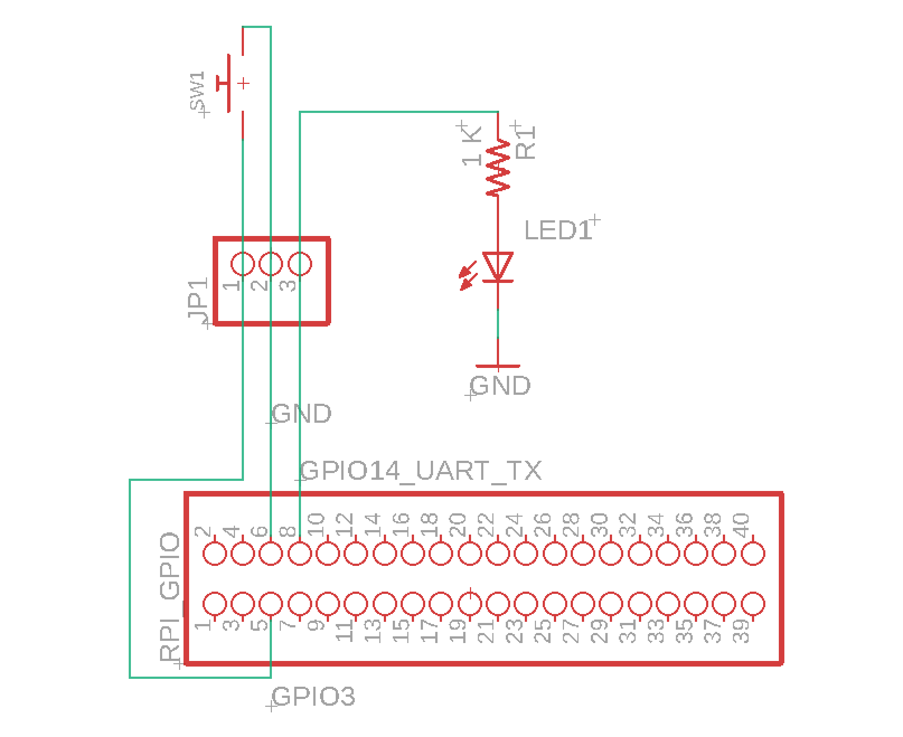
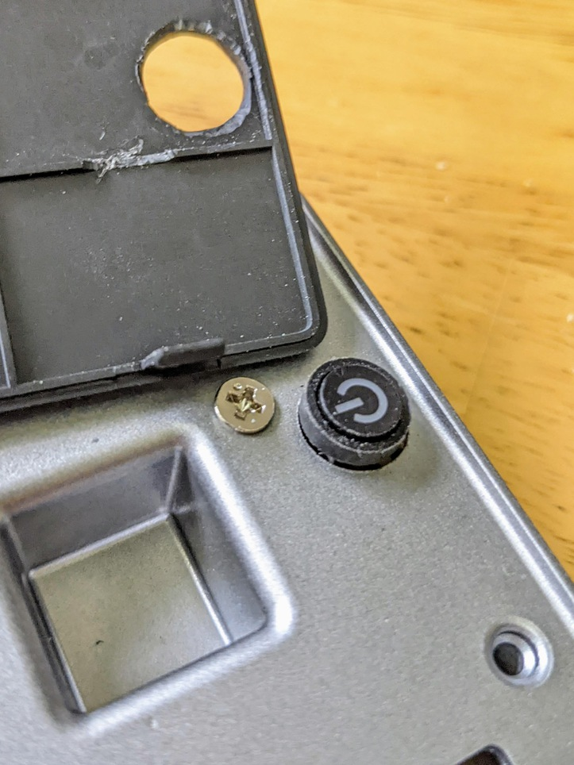
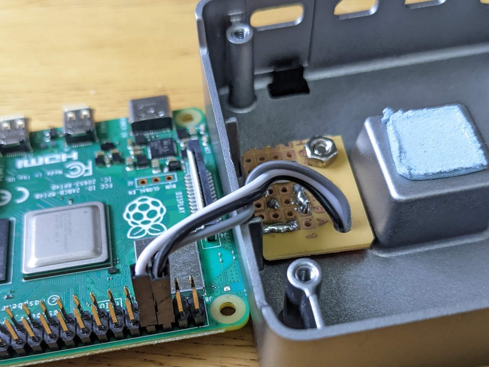

# Raspberry Pi Power Button

Safely shuts down the Pi and starts it, with minimal modification.

## Pros

* No systemd services
* No python scripts
* Works on all models I've tested: Original B+ up to 4B with no OS changes

## Cons

* Piggy-backs on I2C and UART TX pins

## TL;DR - Short pins 5 and 6 briefly

The Raspberry Pi *automatically performs a safe shutdown* when GPIO3 (pin 5)
is grounded momentarily.  There's a handy ground pin nearby (pin 6).

If you're not using UART TX on GPIO 14 (pin 8) then this pin can directly
light up an LED to act as a proxy for the power state of the system.  The Raspberry Pi
GPIO pins can provide up to 16 mA at 3.3 Volts, but we don't need another
bright annoying power LED in the world, so experiment with resistors in the range of
330 Ω to 1 KΩ.  Your LED may be perfectly visible at only 1 mA!

## Pictures





## Using a switch instead of a button

You can use a toggle switch or slide switch with additional boot.txt config.

This makes it so when the switch is closed, the system boots.  When the switch opens,
the shutdown GPIO sees a HIGH signal from the pull-up and safely shuts down the system.

```bash
dtoverlay=gpio-shutdown,active_low=0,gpio_pull=up
```

## Thank you

* <https://pinout.xyz/>
* Raspberry Pi forum members RonR and cleverca22 for [their posts](https://forums.raspberrypi.com/viewtopic.php?t=318122#p1904266)
* adafruit
  * [Mini Illuminated Momentary Pushbutton - Blue Power Symbol](https://www.adafruit.com/product/3105)
* everyone
